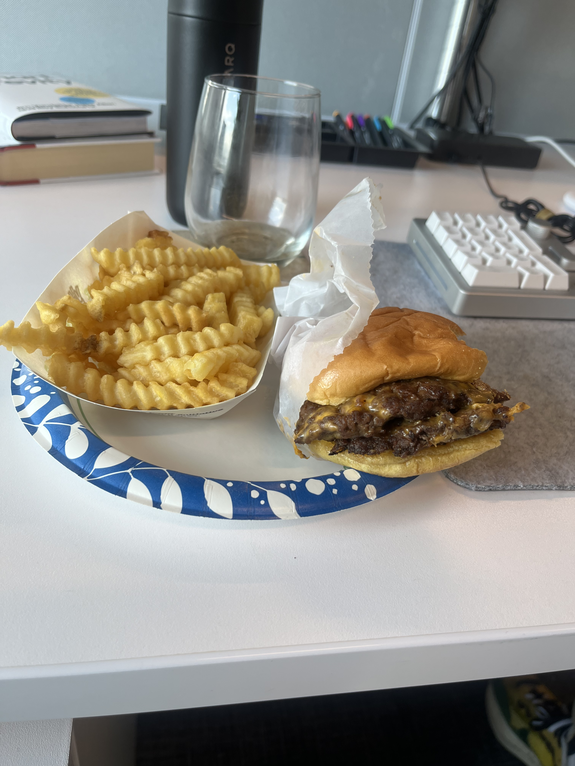

## hours of sleep

7.1

## poi (points of interest)

- mom showed me all the cute clothes she's bought. and the baby carrier (podaegi) and i got to see my aunt.
-

## song stuck in my head

<iframe style="border-radius:12px" src="https://open.spotify.com/embed/track/0WbMK4wrZ1wFSty9F7FCgu?utm_source=generator" width="100%" height="152" frameBorder="0" allowfullscreen="" allow="autoplay; clipboard-write; encrypted-media; fullscreen; picture-in-picture" loading="lazy"></iframe>

## gratitude

- i mean. free shake shack at work.
- thankful for family, and how much love we've been shown
- i have great friends

## reminders

- make decision about this weekend
- spotlight doc
- build list of cars
- train tomorrow
- utils
- move w/d next week

## food log

#### morning:

- frozen berries, spinach, mixed nuts, (2) pea protein
- vitamins and supplements (will add to garden)
- iced coffee

#### lunch:

- [shake shack double cheese with small fries](https://shakeshack.com/sites/default/files/2021-09/SHA_NutritionFacts_ShakeShack-tables-August%2031%2C%202021%20.pdf) 🤤
  

#### afternoon:

- iced coffee

#### evening

- western omelette and homefries
- quinoa, chicken, brussel sprouts and pickled red onions

## habit tracking

- [x] drink 80oz water
- [x] read
- [x] protein
- [x] vitamins & supplements
- [x] meditate
- [] training and/or mobility (link to log)

#### comments
