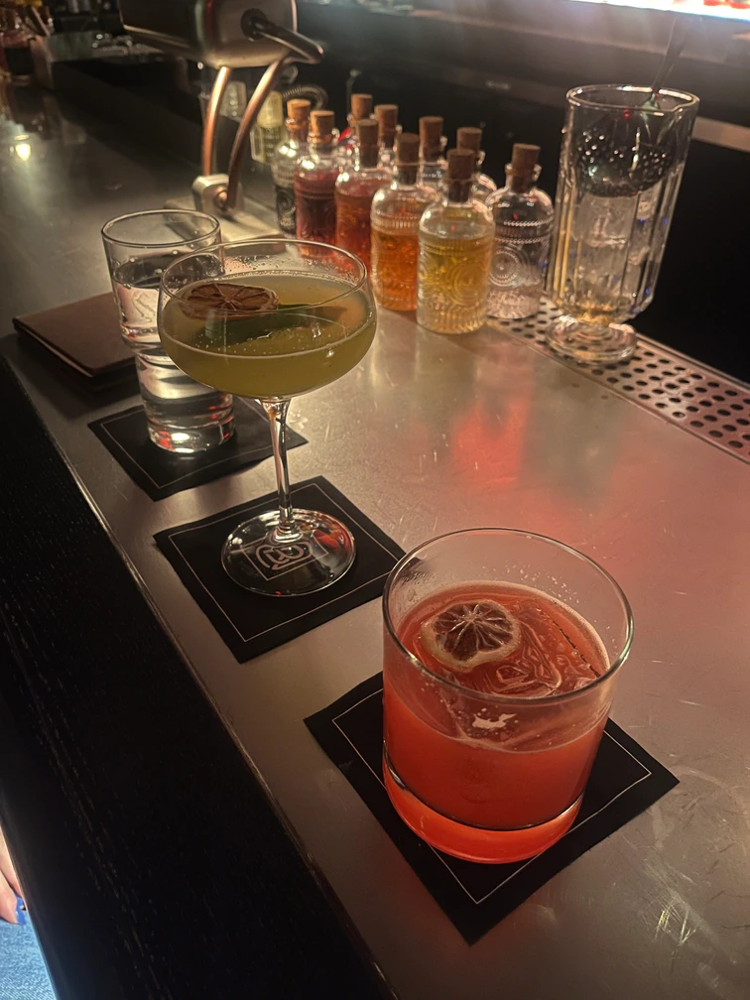

_This post is a retrospective._

## hours of sleep

6.8

## poi (points of interest)
- antsy to get this move going!
- spent far too long thinking through typefaces today
- am i at the place where i should start planning my lunches? 
- started a new book, the atlas six
- setting up utils for the house. can’t believe we get the keys on monday.
- cate and i went to a great spot called the boardroom underneath the hugh building
- nightcap, dinner and drinks at the archer with allison and katie 😀

## song stuck in my head
<iframe style="border-radius:12px" src="https://open.spotify.com/embed/track/14dJexYlvd3t3XAtD1pYW1?utm_source=generator" width="100%" height="152" frameBorder="0" allowfullscreen="" allow="autoplay; clipboard-write; encrypted-media; fullscreen; picture-in-picture" loading="lazy"></iframe>

## gratitude
- it’s probably because i have to go in 4x a week, but that thursday night feeling hits
- happy hour with friends
- been a while since we’ve had a few days of good weather in a row

## reminders
- pick paint colors
- pick up the house before photog 
- 

## food log
#### morning: 
- blue berries + pea protein and whey protein
- vitamins and supplements (will add to garden)
- iced coffee

#### lunch:
- potbelly’s - big turkey & provolone, with everything but oil and mustard 🤤
- oatmeal chocolate cookie

#### afternoon:
- weak iced coffee

#### evening
- 3 cocktails 🥴 - the cocktails at the boardroom were a+

- duck breast burger, brocolli salad [the archer](https://www.archerbar.com/)

## habit tracking

- [x] drink 80oz water
- [x] read
- [ ] protein
- [x] vitamins & supplements
- [ ] meditate
- [ ] training and/or mobility (link to log)

#### comments

