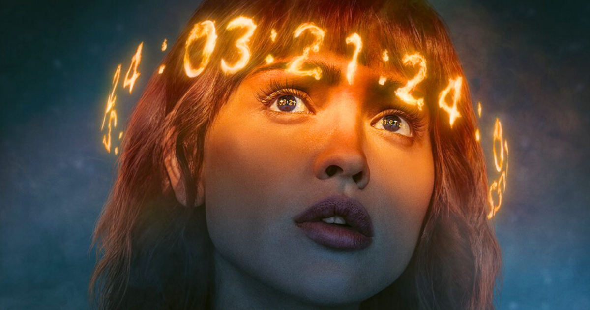

## platform
netflix

## genre
scifi

## my one sentence synop
a detective of an unnamed organization follows a group highly intelligent scientists (both former and current) after their beloved professor commits suicide, sparking curiosity and fear as to what she might have discovered when physics is suddenly broken across the globe.

## small (spoiler free) review
i had low expectations since benioff and weiss were the showrunners. after royally screwing up the end of [game of thrones](https://collider.com/game-of-thrones-ending-bad-explained/), i didn't want my hopes too high. after all, the [hugo award winning books](https://www.thehugoawards.org/hugo-history/2015-hugo-awards/) are some of the most mind-bending, soul-chilling scifi horrors in the lexicon. and, admittedly, i knew i'd be biased because i annoyingly talked about these books to anyone with ears for the better part of 3 months.

much to my surprise, the deliberate departures from the novels weren't necessarily... _bad_. in fact, i thought they worked well and provided some great problem solving with the adaptation. instead of us following 3-4 characters in the book, the show took some liberties and made the story more expansive both in number of characters and geography. given the point of this story, i thought that was a fine enough change.

perhaps my biggest critique of the show is that netflix had to, well, _netflix_. we are all familiar with the 8-episode structure at this point, and whether or not the book follows this pacing, the show must adhere to the formula. where the book slow burns us into the horror of what is to come, netflix rushes the viewing experience, beckoning us to care by increasing shock value early on instead of trusting our patience. and perhaps given today's binge economy, that isn't a liberty we afford creators anymore. i still think they did a good job at capturing the turning point in episode 4, but this moment lacks the same horrific implication as the books because the pace is moving so quickly. 

But give credit where credit is due, much of the important parts, aside from the characters experiencing it, are true enough to the book. This might have done better with 10 episodes, or maybe pace the show so that episode 5 is episode 8, making season 1 more like part 1 of the first book.  

However, again, the netflix formula has its constraints, and even as a lover of this book, it takes a fair bit of text before you really get absorbed into what's actually taking place. Perhaps, given their [current state of affairs](https://www.msn.com/en-us/money/markets/why-netflix-s-most-bullish-analyst-says-the-stock-is-no-longer-a-best-idea/ar-BB1kEf76), it only makes sense to drop us in the deep end of a truly insane world that, *spoiler alert*, only gets crazier, if not incomprehensible.

overall, worth a watch as there isn't much else going on. it's entertaining. i just wish it were as thought provoking and mind-bending as i remember the books were. 

## slap rating
the graphics slapped, even for netflix
the show get a *love pat* on the face

## up next
[dororo](https://dororo-anime.com/) 