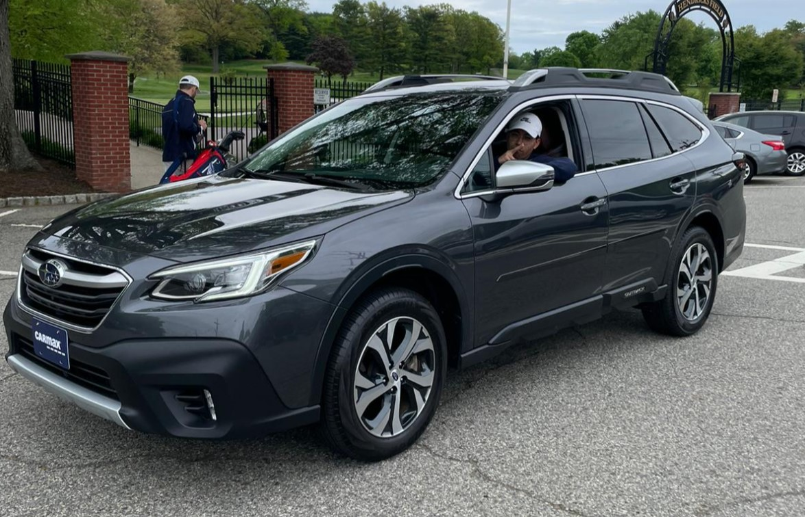

## poi (points of interest)

- wild week! it's just been a week of so many logistics with vendors. 
- my entire team was on holiday for almost a week :) lol but we got through it
- contractors have started work on the house
- i kept getting build errors with the site, hence the first weekly update. i may move to this format? but we shall see, or shorten the daily.
- we got a new car! and i already love it. it will definitely get its own tree, as will the sonic if i can keep it around long enough.

- the rap beef of the millennia. felt like we haven't had a cultural moment like this in a very long time. and yes, kendrick won. not even sure how anyone out there thinks otherwise.
- mom came back from korea :D 

## song stuck in my head

there are plenty from the last week:

<iframe style="border-radius:12px" src="https://open.spotify.com/embed/track/77DRzu7ERs0TX3roZcre7Q?utm_source=generator" width="100%" height="152" frameBorder="0" allowfullscreen="" allow="autoplay; clipboard-write; encrypted-media; fullscreen; picture-in-picture" loading="lazy"></iframe>
need i say anything? kdot bodied this. and this...

<iframe style="border-radius:12px" src="https://open.spotify.com/embed/track/6AI3ezQ4o3HUoP6Dhudph3?utm_source=generator" width="100%" height="152" frameBorder="0" allowfullscreen="" allow="autoplay; clipboard-write; encrypted-media; fullscreen; picture-in-picture" loading="lazy"></iframe>

who knew kung fu kenny was hilarious? i didn't but this song is ridiculous lol and definitely the kill shot in this beef.

<iframe style="border-radius:12px" src="https://open.spotify.com/embed/track/751srcHf5tUqcEa9pRCQwP?utm_source=generator" width="100%" height="152" frameBorder="0" allowfullscreen="" allow="autoplay; clipboard-write; encrypted-media; fullscreen; picture-in-picture" loading="lazy"></iframe>

not sure what it is about this song.. but when she hits that flip, i get chills. it's so cali pop punk and such a throwback to high school. also, i love that it's named "tek it" which seems like is a reference to "teching" in smash bros, which would be apt for a song about a situationship. this song has gotten popular due to tiktok, and its most recent sample in [red moon by lil uzi vert.](https://www.youtube.com/watch?v=2NzuR5OLvnQ&pp=ygUQcmVkIG1vb24gbGlsIHV6aQ%3D%3D)

<iframe style="border-radius:12px" src="https://open.spotify.com/embed/track/7fzHQizxTqy8wTXwlrgPQQ?utm_source=generator" width="100%" height="152" frameBorder="0" allowfullscreen="" allow="autoplay; clipboard-write; encrypted-media; fullscreen; picture-in-picture" loading="lazy"></iframe>

at first i thought it was brent faiyaz, but after listening a bit closer, i realized the lyrics weren't as toxic as a classic faiyaz track lol. in my stupor of "will they, won't they?" regarding kendrick and drake the drizzler, i completely missed this track soaring up the charts. but what's special is not the fact that this is a certified bop (although it is), or that this funky af (although it is), but he has a line 
> took her to Queen's Gambit (yeah, yeah), showed around my friends (right now)
being that this track sounds straight outta dc, i decided to do some snooping. in my mind i thought there's no way he's referencing the only dive bar in woodbridge... lo and behold, this man is _from_ woodbridge, va LOL anyway, i'll rep him forever for that reason alone. hope he keeps producing heat.

## gratitude

- i've been shuttling to the house nearly everyday... it's wonderfully peaceful. the neighborhood is lush and green.
- thankful to have two cars with nice room for cargo lol
- i am happy we bought this house. every time i see updates, i get more excited. the floors will really make this place ours. and the nursey color katie picked is so nice 😍
- our neighbors are really nice. one of their sons helped me moved the w/d today.
- parents coming to the shower!
- also just for everyone sending us gifts from our registry and the kind words. it's humbling.

## reminders

- the cabinets in the kitchen are from lowe's
- set up an appointment to hook up the w/d in the basement
- create a house branch in the garden
    - create a shopping/wishlist
    - pictures/FYIs (where's the gas line, water line, etc etc)
    - to do

## food log

overall - i have **not** been paying too much attention, and i've been eating out a lot while running around. we will settle down and get back to routine soon. 

#### comments

- i hate not feeling settled in my own home, but that's normal. and we will be all moved in soon enough. it feels like christmas. i started to sweep my deck the other day just because.
